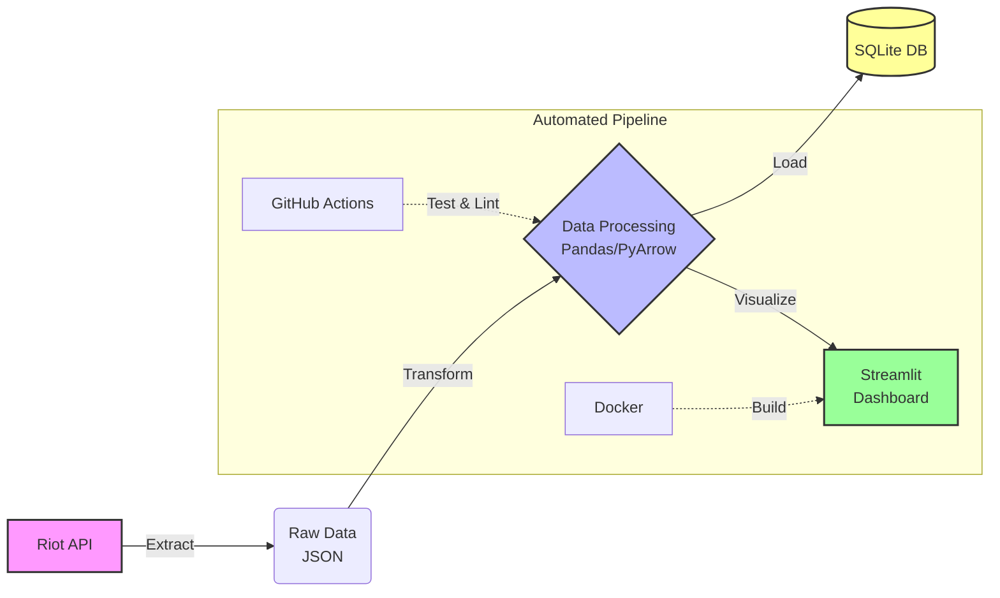

# LoL Challenger Data Pipeline


An End-to-End data pipeline that collects, transforms, loads, and visualizes League of Legends Challenger tier data using the Riot API.

---

## Architecture Overview



---

## Key Features

- **Automated ETL Pipeline:** Full automation using Python scripts.
- **Enterprise Logging:** Implemented `RotatingFileHandler` for log management.
- **Data Integrity:** KNN Imputation for missing values and leakage prevention.
- **DevOps Standards:** `Makefile` for build automation and pre-commit hooks.
- **Config Management:** Centralized YAML configuration.

---

## Quick Start

### 1. Installation
Run the following command to install dependencies:
```bash
make install
```

### 2. Configuration
Create a `.env` file and add your Riot API key:
```env
RIOT_API_KEY=your_api_key_here
```

### 3. Execution
Run the full ETL pipeline:
```bash
make run
```

### 4. Dashboard
Launch the analytics dashboard:
```bash
make dashboard
```

#### Dashboard Preview

> **Snapshot:** Challenger Tier players' win-rate distribution and correlation analysis.

---

## Project Structure

The project follows a modular architecture designed for scalability and maintainability.

```text
lol-data-pipeline/
├── .github/workflows/   # CI/CD Pipeline Configuration (GitHub Actions)
├── docs/                # Documentation (ADR, ERD, Analysis Reports)
├── etl/                 # ETL Modules
│   ├── extract.py       # Riot API Data Fetcher
│   ├── transform.py     # Data Cleaning & Feature Engineering
│   └── load.py          # SQLite Database Loader
├── tests/               # Unit & Integration Tests (Pytest)
├── utils/               # Shared Utilities (Logger, Config Loader)
├── .gitignore           # Git Exclusion Rules
├── config.yaml          # Centralized Configuration
├── dashboard.py         # Streamlit Analytics Dashboard (Visualization)
├── Dockerfile           # Docker Container Definition
├── main.py              # Pipeline Entry Point
├── Makefile             # Automation Commands (Make run, Make test)
├── README.md            # Project Overview & Documentation
└── requirements.txt     # Python Dependencies
```

---

## Data Schema (ERD)


## Engineering Challenges & Lessons Learned (삽질 로그 및 성찰)

1. "완벽한 스키마보다 유연한 시스템이 우선이다"
Challenge: Riot API의 응답 필드명이 예고 없이 변경(CamelCase vs snake_case 등)되면서 파이프라인이 수시로 중단되는 현상 발생.

Fail: 처음에는 엄격한 데이터 검증(Strict Validation)을 적용했으나, 사소한 필드 추가/변경에도 전체 데이터 수집이 멈춰 특정 시간대의 데이터 공백이 생김.

Reflection: Applied ML 환경에서는 데이터의 양(Volume)과 연속성이 모델의 신뢰도와 직결됨. 시스템이 멈추는 것보다, 필수 정보 위주로 '최대한 수집을 지속'하는 것이 더 중요함을 깨달음.

Solution: Defensive Schema Mapping 로직을 도입. 필수 필드(LP, Wins 등) 외의 변경에는 유연하게 대응하도록 설계하여 시스템 가용성(Availability)을 99% 이상으로 개선.

2. "인프라 구축은 비용과 확장성의 트레이드오프다"
Challenge: 초기에는 가벼운 SQLite를 사용했으나, 추후 ML 모델 학습 시 대량의 동시 읽기(Read) 요청을 처리하기엔 한계가 있음을 인지.

Decision: 관리 리소스는 늘어나지만, 데이터 무결성과 동시성 제어에 강점이 있는 **PostgreSQL(Docker)**로 마이그레이션 결정.

Cost Efficiency: 전체 서버를 상시 가동하는 대신, Docker를 활용해 리소스 점유를 최소화하고, 필요한 시점에만 chunksize를 조절해 메모리 버스트(Memory Burst)를 방지하도록 설계하여 연산 자원 비용 절감 고려.

## Cost-Centric Engineering (비용 중심 사고)

Applied ML 엔지니어로서 단순히 "정확도"만 쫓는 것이 아니라, 서비스 운영 비용을 고려한 설계를 반영했습니다.

Storage Optimization: Raw 데이터를 무분별하게 쌓는 대신, 원본 JSON을 백업하고 데이터베이스에는 정제된 피처(Feature)만 적재하여 스토리지 낭비를 방지했습니다. (향후 압축 보관 로직 추가 예정)

API Quota Management: 429 에러(Rate Limit) 발생 시 무차별적인 재시도 대신, 지수 백오프(Exponential Backoff) 개념을 로그와 알림에 반영하여 불필요한 네트워크 트래픽 및 API 차단 리스크를 최소화했습니다.

Compute Resource: Pandas의 벡터화 연산(NumPy 기반)을 활용하여 데이터 가공 속도를 높임으로써 CPU 점유 시간을 단축했습니다.

## 🛠️ Troubleshooting & Pipeline Stability

자동화 파이프라인 구축 과정에서 발생한 기술적 이슈와 이를 해결한 방안을 기록합니다.

### 1. Schema Drift & KeyError Handling
- **Issue**: Riot API의 응답 데이터 구조 변경(Column 누락 및 명칭 변경)으로 인해 전처리 단계에서 `KeyError` 발생.
- **Solution**: `transform.py` 내에 **Defensive Mapping** 로직을 구현하였습니다. 필수 컬럼이 누락될 경우 기본값(`Unknown`, `0`)을 할당하고, 동적으로 스키마를 매핑하여 API 사양 변경에도 파이프라인이 중단되지 않도록 설계했습니다.

### 2. SQLite Database Concurrency (Locking Error)
- **Issue**: GitHub Actions 가상 환경에서 데이터 적재 시 `OperationalError: database is locked` 발생. SQLite의 단일 쓰기 제한으로 인해 발생한 병목 현상을 확인했습니다.
- **Solution**:
  - `load.py`의 SQLAlchemy Engine 설정에 `connect_args={'timeout': 30}` 옵션을 추가하여 대기 시간을 확보했습니다.
  - 가상 환경 내 프로세스 간 충돌을 방지하기 위해 연결 관리를 최적화하여 데이터 무결성을 유지하며 적재에 성공했습니다.

### 3. CI/CD Pipeline Orchestration
- **Issue**: GitHub Actions의 Workflow 실행 시 환경 변수(`Secrets`) 주입 누락으로 인한 인증 실패.
- **Solution**: `main.yml`의 `env` 섹션을 고도화하여 보안이 필요한 API Key와 Webhook URL을 안전하게 격리하였고, 실행 성공 여부를 Slack 알림을 통해 실시간으로 모니터링할 수 있는 시스템을 구축했습니다.
