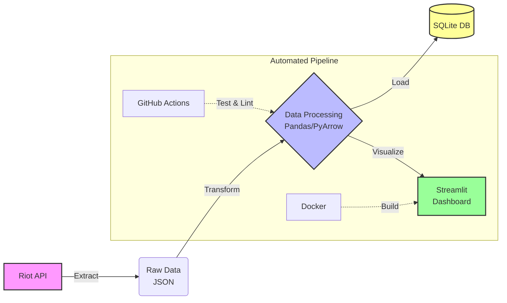

# LoL Challenger Data Pipeline


An End-to-End data pipeline that collects, transforms, loads, and visualizes League of Legends Challenger tier data using the Riot API.

---

## Architecture Overview



---

## Key Features

- **Automated ETL Pipeline:** Full automation using Python scripts.
- **Enterprise Logging:** Implemented `RotatingFileHandler` for log management.
- **Data Integrity:** KNN Imputation for missing values and leakage prevention.
- **DevOps Standards:** `Makefile` for build automation and pre-commit hooks.
- **Config Management:** Centralized YAML configuration.

---

## Quick Start

### 1. Installation
Run the following command to install dependencies:
```bash
make install
```

### 2. Configuration
Create a `.env` file and add your Riot API key:
```env
RIOT_API_KEY=your_api_key_here
```

### 3. Execution
Run the full ETL pipeline:
```bash
make run
```

### 4. Dashboard
Launch the analytics dashboard:
```bash
make dashboard
```

#### Dashboard Preview

> **Snapshot:** Challenger Tier players' win-rate distribution and correlation analysis.

---

## Project Structure

The project follows a modular architecture designed for scalability and maintainability.

```text
lol-data-pipeline/
├── .github/workflows/   # CI/CD Pipeline Configuration (GitHub Actions)
├── docs/                # Documentation (ADR, ERD, Analysis Reports)
├── etl/                 # ETL Modules
│   ├── extract.py       # Riot API Data Fetcher
│   ├── transform.py     # Data Cleaning & Feature Engineering
│   └── load.py          # SQLite Database Loader
├── tests/               # Unit & Integration Tests (Pytest)
├── utils/               # Shared Utilities (Logger, Config Loader)
├── .gitignore           # Git Exclusion Rules
├── config.yaml          # Centralized Configuration
├── dashboard.py         # Streamlit Analytics Dashboard (Visualization)
├── Dockerfile           # Docker Container Definition
├── main.py              # Pipeline Entry Point
├── Makefile             # Automation Commands (Make run, Make test)
├── README.md            # Project Overview & Documentation
└── requirements.txt     # Python Dependencies
```

---

## Data Schema (ERD)


