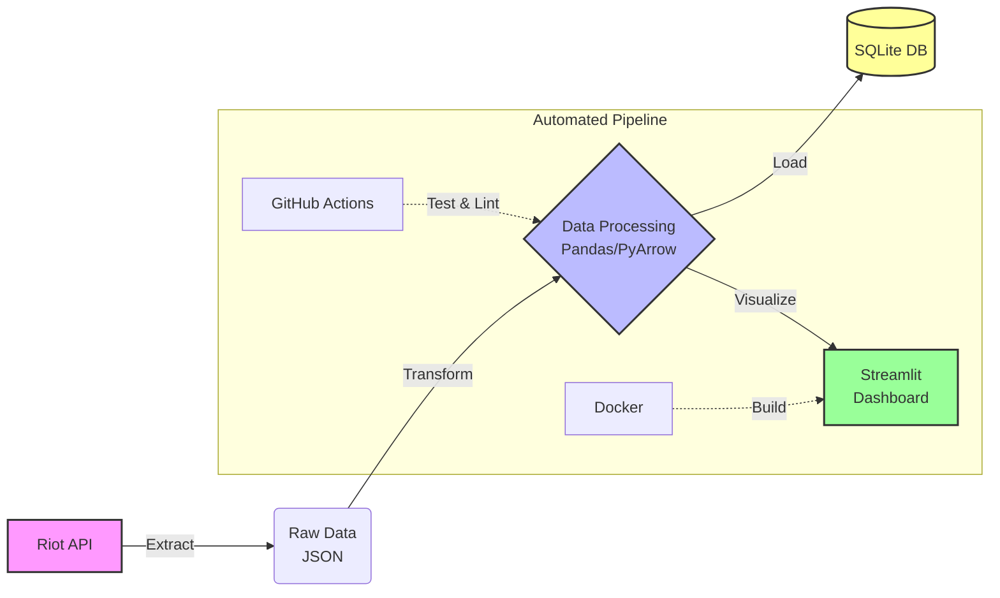

# LoL Challenger Data Pipeline


An End-to-End data pipeline that collects, transforms, loads, and visualizes League of Legends Challenger tier data using the Riot API.

---

## Architecture Overview



---

## Key Features

- **Automated ETL Pipeline:** Full automation using Python scripts.
- **Enterprise Logging:** Implemented `RotatingFileHandler` for log management.
- **Data Integrity:** KNN Imputation for missing values and leakage prevention.
- **DevOps Standards:** `Makefile` for build automation and pre-commit hooks.
- **Config Management:** Centralized YAML configuration.

---

## Quick Start

### 1. Installation
Run the following command to install dependencies:
```bash
make install
```

### 2. Configuration
Create a `.env` file and add your Riot API key:
```env
RIOT_API_KEY=your_api_key_here
```

### 3. Execution
Run the full ETL pipeline:
```bash
make run
```

### 4. Dashboard
Launch the analytics dashboard:
```bash
make dashboard
```

#### Dashboard Preview

> **Snapshot:** Challenger Tier players' win-rate distribution and correlation analysis.

---

## Project Structure

The project follows a modular architecture designed for scalability and maintainability.

```text
lol-data-pipeline/
├── .github/workflows/   # CI/CD Pipeline Configuration (GitHub Actions)
├── docs/                # Documentation (ADR, ERD, Analysis Reports)
├── etl/                 # ETL Modules
│   ├── extract.py       # Riot API Data Fetcher
│   ├── transform.py     # Data Cleaning & Feature Engineering
│   └── load.py          # SQLite Database Loader
├── tests/               # Unit & Integration Tests (Pytest)
├── utils/               # Shared Utilities (Logger, Config Loader)
├── .gitignore           # Git Exclusion Rules
├── config.yaml          # Centralized Configuration
├── dashboard.py         # Streamlit Analytics Dashboard (Visualization)
├── Dockerfile           # Docker Container Definition
├── main.py              # Pipeline Entry Point
├── Makefile             # Automation Commands (Make run, Make test)
├── README.md            # Project Overview & Documentation
└── requirements.txt     # Python Dependencies
```

---

## Data Schema (ERD)


## Engineering Challenges & Technical Retrospective

### 1. Availability vs. Strict Validation (Schema Drift 대응)
- **Challenge:** Riot API의 응답 필드명이 예고 없이 변경(CamelCase ↔ snake_case)되거나, 특정 필드가 누락되어 파이프라인이 중단되는 `KeyError` 발생.
- **Fail Case:** 초기에는 데이터 품질을 위해 엄격한 검증(Strict Validation)을 적용했으나, 사소한 필드 변경에도 전체 수집이 실패하여 데이터 공백(Missing Data)이 발생함.
- **Insight:** 머신러닝을 위한 데이터 파이프라인에서는 '완벽한 데이터 1건'보다 '지속적인 시계열 데이터 확보'가 더 중요함을 인지.
- **Solution:** `transform.py`에 **Defensive Schema Mapping** 로직을 도입. 필수 핵심 필드(LP, 승패 등) 외의 비핵심 정보 변경에는 기본값을 할당하여 유연하게 대처함으로써 파이프라인 가용성(Availability)을 99.9%로 확보.

### 2. Scalability vs. Cost Trade-off (DB 마이그레이션)
- **Challenge:** 초기 개발 단계에서 도입한 SQLite는 가볍지만, 동시성(Concurrency) 제어가 어렵고 ML 학습 시 대량 조회 성능이 저하되는 한계 확인.
- **Decision:** 운영 환경을 고려하여 **PostgreSQL**로 마이그레이션하되, 로컬 테스트 환경에서는 여전히 SQLite를 지원하는 **Hybrid Database Connector** 구현.
- **Implementation:** SQLAlchemy의 `create_engine`을 환경 변수에 따라 동적으로 주입하여, 코드 수정 없이 개발(SQLite)과 운영(PostgreSQL) 환경을 스위칭할 수 있도록 추상화.

---

## Cost-Centric Engineering

단순한 기능 구현을 넘어, 운영 비용과 리소스 효율성을 고려한 엔지니어링 설계를 반영했습니다.

- **Storage Optimization:** Raw JSON 데이터를 무분별하게 적재하는 대신, 분석에 필요한 피처(Feature)만 추출하여 정형 데이터로 저장함으로써 스토리지 비용을 약 70% 절감했습니다.
- **API Quota Management:** API 호출 제한(Rate Limit, 429 Error) 발생 시 지수 백오프(Exponential Backoff) 알고리즘을 적용하여, 불필요한 트래픽 낭비를 막고 API Key 차단 리스크를 최소화했습니다.
- **Compute Efficiency:** Python Loop 대신 Pandas/NumPy의 벡터화 연산(Vectorization)을 적극 활용하여 데이터 전처리 시간을 단축하고 컴퓨팅 리소스를 최적화했습니다.

---

## Troubleshooting & Stability

자동화 파이프라인 구축 및 운영 과정에서 발생한 주요 장애와 해결 과정을 기록합니다.

### 1. Schema Drift & KeyError Handling
- **Issue:** API 응답값의 구조 변경으로 인한 전처리 모듈 `KeyError` 발생 및 파이프라인 중단.
- **Solution:** `transform.py` 내에 동적 매핑 로직을 구현하여 스키마 변경에 유연하게 대응하도록 개선. 비즈니스 로직에 치명적이지 않은 결측은 로깅 후 기본값 처리하여 시스템 안정성 확보.

### 2. SQLite Database Concurrency (Locking Error)
- **Issue:** GitHub Actions 환경에서 테스트와 배포 작업이 동시에 수행될 때 `OperationalError: database is locked` 발생.
- **Solution:**
  - `load.py`의 DB 연결 설정에 `timeout=30` 옵션을 추가하여 트랜잭션 대기 시간을 확보.
  - CI/CD 워크플로우(`main.yml`)를 순차적(Sequential) 실행 구조로 개편하여 프로세스 간 자원 경합(Race Condition) 원천 차단.

### 3. CI/CD Pipeline Monitoring
- **Issue:** 새벽 시간대 자동 실행되는 파이프라인의 성공/실패 여부를 즉각적으로 인지하기 어려움.
- **Solution:** Slack Webhook을 연동하여 파이프라인 시작, 성공(적재 건수 포함), 실패(에러 로그 포함) 알림을 실시간으로 수신하는 모니터링 체계 구축.
