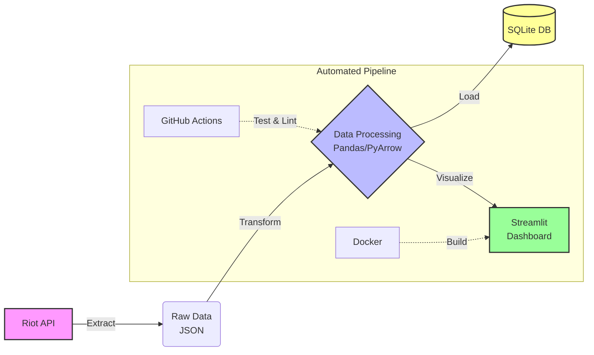
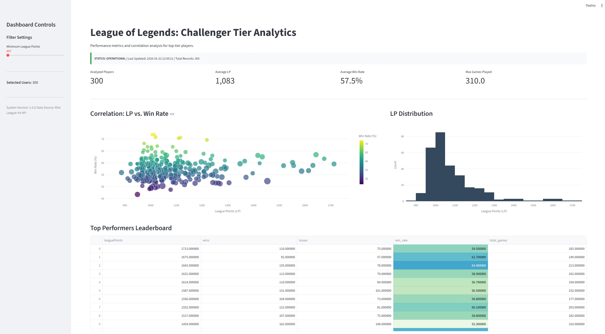
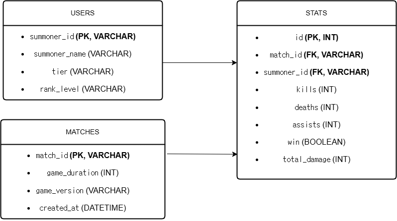

# LoL Challenger Data Pipeline

[Python 3.9+] [Code Style: Black] [License: MIT]

An End-to-End data pipeline that collects, transforms, loads, and visualizes League of Legends Challenger tier data using the Riot API.

---

## Architecture Overview

## Architecture Overview

---

## Key Features

- Automated ETL Pipeline: Full automation using Python scripts.
- Enterprise Logging: Implemented RotatingFileHandler for log management.
- Data Integrity: KNN Imputation for missing values and leakage prevention.
- DevOps Standards: Makefile for build automation and pre-commit hooks.
- Config Management: Centralized YAML configuration.

---

## Quick Start

### 1. Installation
Run the following command to install dependencies:
$ make install

### 2. Configuration
Create a .env file and add your Riot API key:
RIOT_API_KEY=your_api_key_here

### 3. Execution
Run the full ETL pipeline:
$ make run

### 4. Dashboard
Launch the analytics dashboard:
$ make dashboard

---

## Project Structure

.
├── etl/                # ETL Modules (Extract, Transform, Load)
├── utils/              # Utility functions (Config loader)
├── tests/              # Unit Tests (Config, Data Quality)
├── config.yaml         # Centralized Configuration
├── Makefile            # Build Commands
└── README.md           # Project Documentation

> **Snapshot:** Challenger Tier players' win-rate distribution and correlation analysis.

## Data Schema (ERD)

